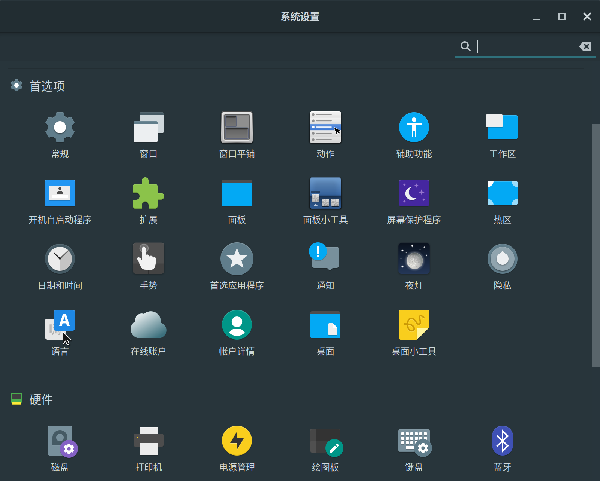
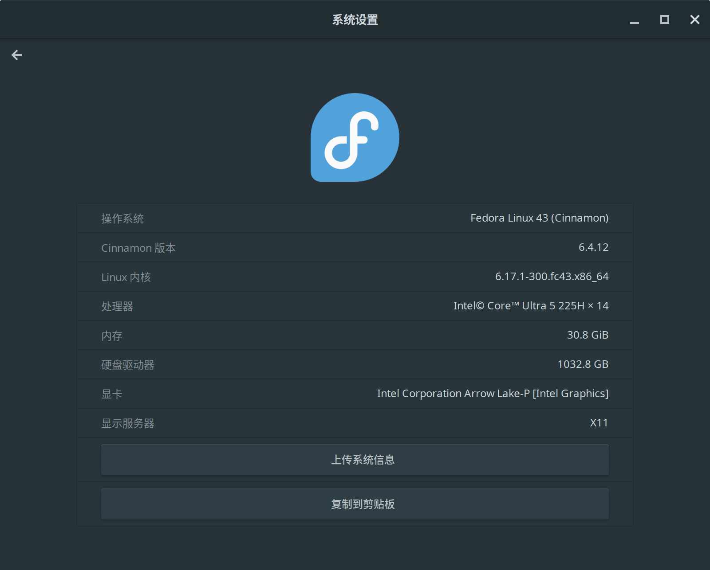
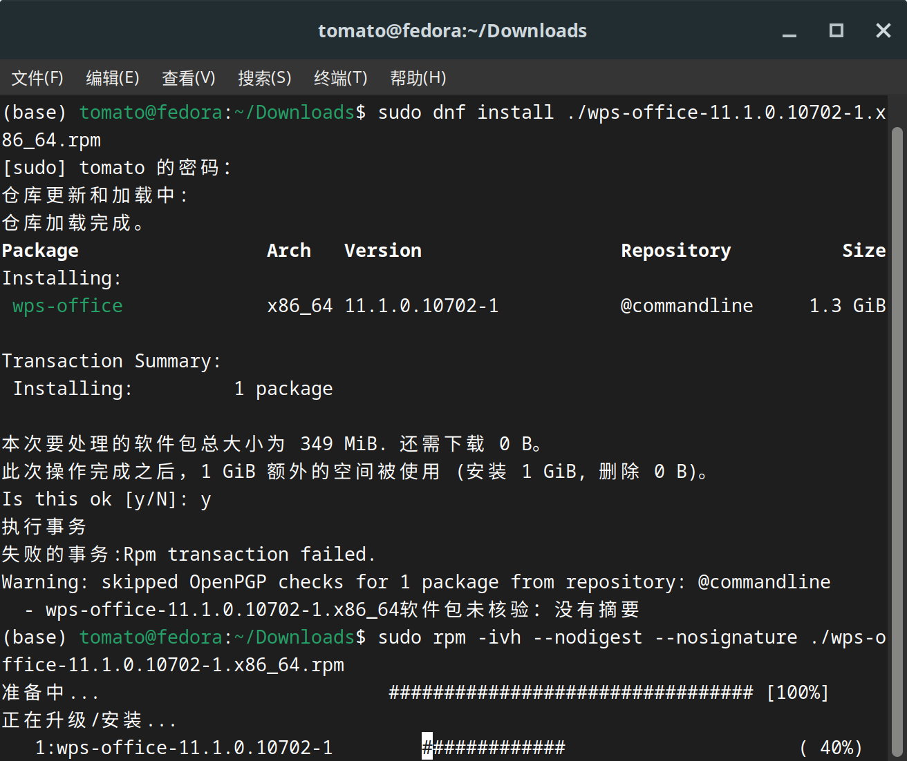

公司给了个 ThinkBook 14, 原装是 Windows 11, 可能是用的人多了，系统糊成狗屎一样，难用的要死，用户名还是之前人的名字，感觉很诡异。正好因为要用 Ubuntu 的系统盘，索性装个 Fedora 吧。

下载不用多说什么了，直接上官网，下载最新的 Fedora Workstation 版本的 ISO 镜像就行了。下载完成后，使用 Rufus 或者 balenaEtcher 之类的软件将 ISO 镜像写入到一个 USB 闪存盘中，制作成可启动的安装盘。（只可惜我用的 Ventoy）

我下载的 Fedora Cinnamon Desktop Spins，这个用的多，以前就用 Arch Linux 的时候也用过，感觉还不错。安装过程和其他 Linux 发行版差不多，选择语言、键盘布局、磁盘分区等，按照提示一步步操作就行了。

注意一点是，用户目录保持英文的问题。我是安装的时候选英文，后面再进系统换回中文的，这样用户目录就不会变成中文了。因为如果用户目录是中文的，很多软件可能会因为路径问题而出错。



安装完成后看看系统配置：



现在就可以马克擦车了：

```bash
sudo dnf makecache
```

为什么不运行 `sudo dnf update` 呢？因为 Fedora 的更新可能会比较大，尤其是第一次更新，可能会下载很多包，耗时较长。运行 `sudo dnf makecache` 可以先更新软件包缓存，这样在后续安装软件时会更快。（其实就是以前用 Arch 的时候滚动更新滚怕了，前一天在公司把电脑合上，第二天上班的时候进不去系统报 Kernel Panic......）

下面就是安装输入法了，这个我走了弯路。原本想用 ibus-rime 的，结果安装之后发现 ibus 在 Electron 应用里有问题，输入法无法正常使用。后来换成了 fcitx5-rime，安装之后就没有问题了。

```bash
sudo dnf install fcitx5-rime
```

然后配合使用东风破（Plum）安装雾凇拼音：

```bash
# 请先安装 git 和 bash，并加入环境变量
# 请确保和 github.com 的连接稳定
cd ~
git clone https://github.com/rime/plum.git plum
# 卸载 plum 只需要删除 ~/plum 文件夹即可
```

接着：

```bash
cd ~/plum
rime_frontend=fcitx5-rime bash rime-install iDvel/rime-ice:others/recipes/full
```

再次重新部署 Rime，使用 Ctrl + ~ 键，来选择雾凇拼音。

插入一个小插曲：我想直接用 fcitx5 的，然后把 ibus 卸载。结果卸载 ibus 的时候用了 `sudo dnf remove ibus*`，我是万万没想到现在都在往 Wayland 方向发展，我还以为还在用 X11,卸载的时候没看直接 y 了，整个桌面都没了。只能说我被 Arch 鞭打太多次了已经习惯了， 直接 `sudo dnf install @cinnamon-desktop-environment` 重新安装 Cinnamon 桌面环境，重启之后 `sudo systemctl enable lightdm.service && sudo systemctl start lightdm.service` 就好了。

然后就是安装 WPS，切忌切忌安装外版的 WPS，国内的广告满天飞（你是把雷军他妈的骨灰盒打包放进去了吗？），直接上国外的版本，安装包里没有广告，安装完成后就没有了。

```bash
wget https://wdl1.pcfg.cache.wpscdn.com/wpsdl/wpsoffice/download/linux/11723/wps-office-11.1.0.11723.XA-1.x86_64.rpm

sudo rpm -ivh --nodigest --nosignature ./wps-office-11.1.0.11723.XA-1.x86_64.rpm
```

别问为什么 RPM 安装要带那么多参数，问就是傻X WPS 程序员写得烂，安装包里没有签名和摘要，所以必须加上 `--nodigest --nosignature` 参数才能安装成功。



还有就是老生常谈的 WPS 缺字体的问题了。参考[dv-anomaly/ttf-wps-fonts](https://github.com/dv-anomaly/ttf-wps-fonts)这个项目或者[xChen16/wps-fonts](https://github.com/xChen16/wps-fonts)或者[owlman/wps_fonts](https://gitee.com/owlman/wps_fonts)就行。

但是主界面还是有方框，解决方案如下：

```bash
sudo dnf install https://download1.rpmfusion.org/free/fedora/rpmfusion-free-release-$(rpm -E %fedora).noarch.rpm https://download1.rpmfusion.org/nonfree/fedora/rpmfusion-nonfree-release-$(rpm -E %fedora).noarch.rpm
sudo dnf makecache
sudo dnf install google-noto-sans-cjk-vf-fonts
sudo dnf install wqy-microhei-fonts
sudo dnf install wqy-zenhei-fonts
sudo dnf install langpacks-zh_CN
sudo dnf install google-noto-sans-cjk-fonts google-noto-serif-cjk-fonts wqy-zenhei-fonts wqy-microhei-fonts
sudo dnf remove libreoffice-core
```

不记得是哪个了，反正一套连招下来显示正常了。

然后就是喜闻乐见的 Typora 安装了。Typora 官方没给 RPM 包，只有 DEB 包，所以我找了个 GitHub 项目来搞定这个安装：

```bash
sudo dnf install pandoc
git clone https://github.com/RPM-Outpost/typora.git
cd typora/
chmod +x create-package.sh
./create-package.sh
```

好像就这么些了。