# NVIDIA BlueField-3 DPU 200GbE/NDR200

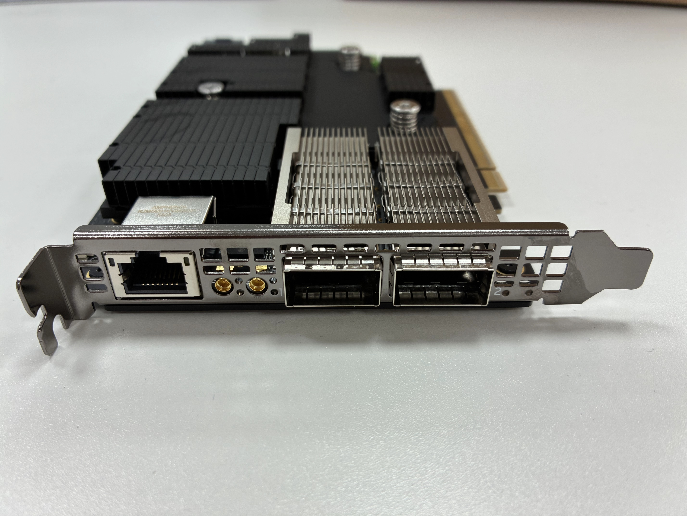

# NVIDIA ConnectX-8 SuperNIC

## 测试截图

### BIOS 下识别情况

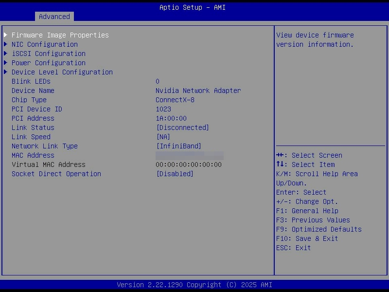

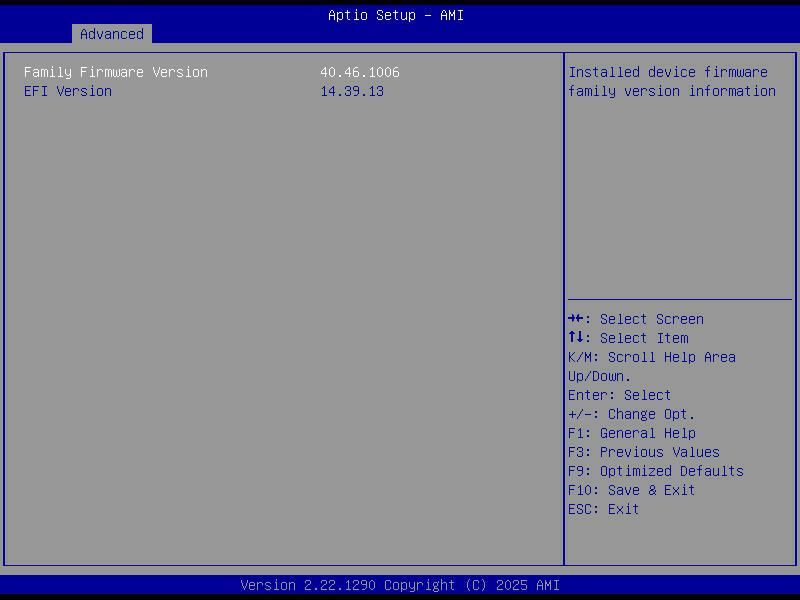

### BMC 下识别情况

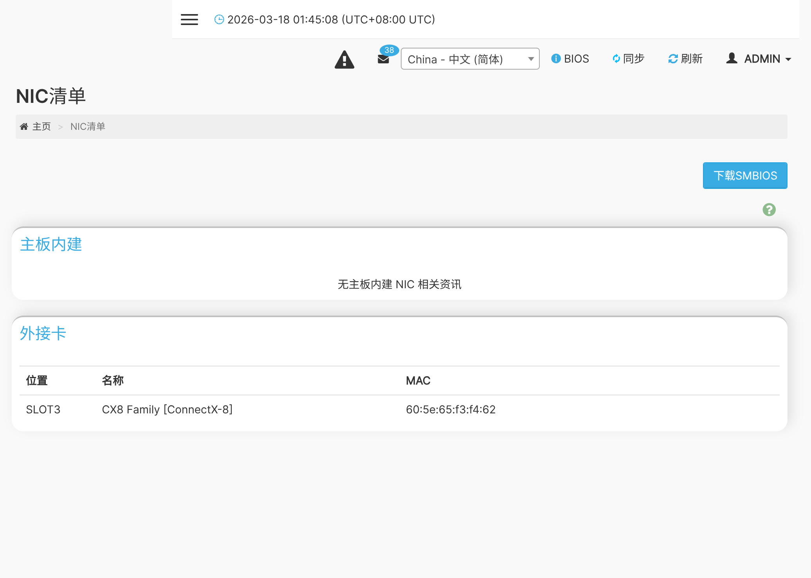

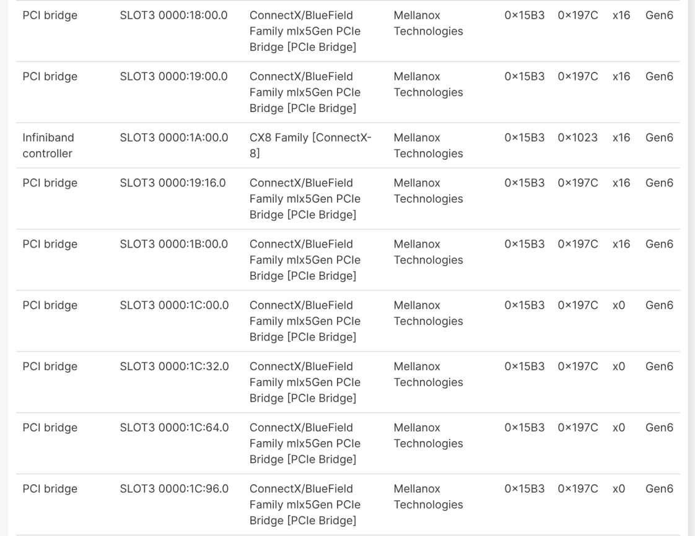

### Linux 下识别情况

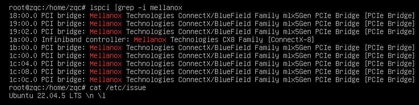

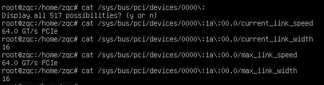

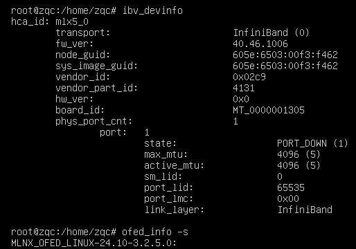

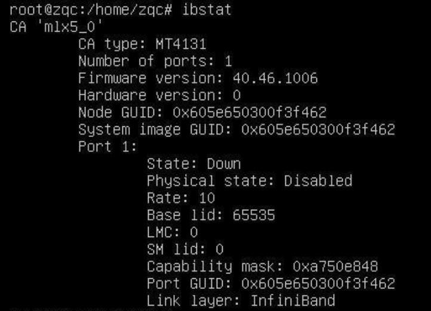

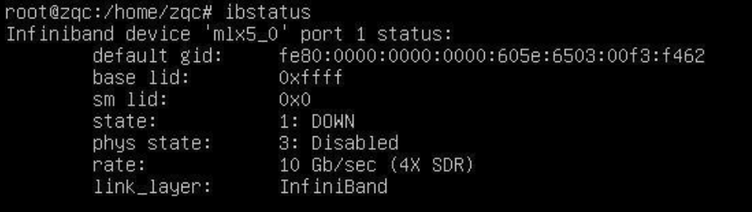

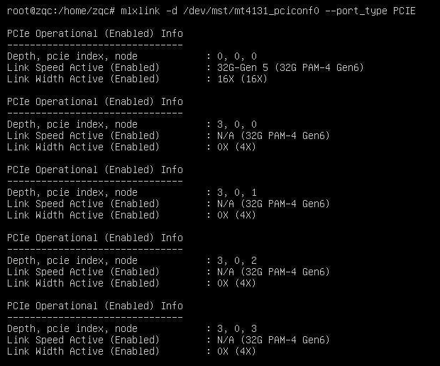

Link Speed Active (Enabled)  : 32G-Gen 5 (32G PAM-4 Gen6) 表示当前实际跑在 Gen5 x16，括号里的 32G PAM-4 Gen6 是卡本身的能力上限。Xeon 8558 只支持 PCIe Gen5，所以卡被降级到 Gen5 是正常的。

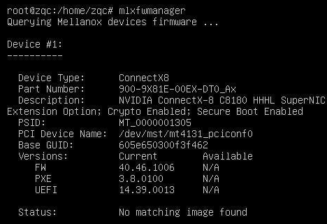

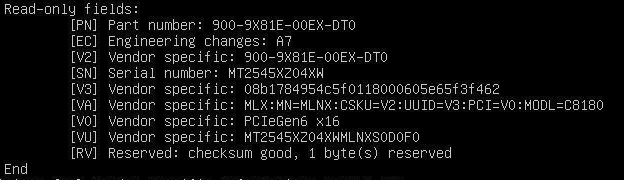

## 实物图

